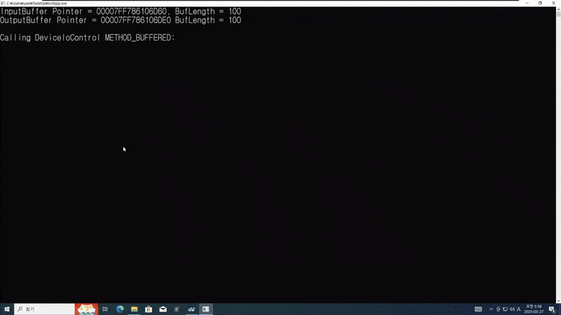
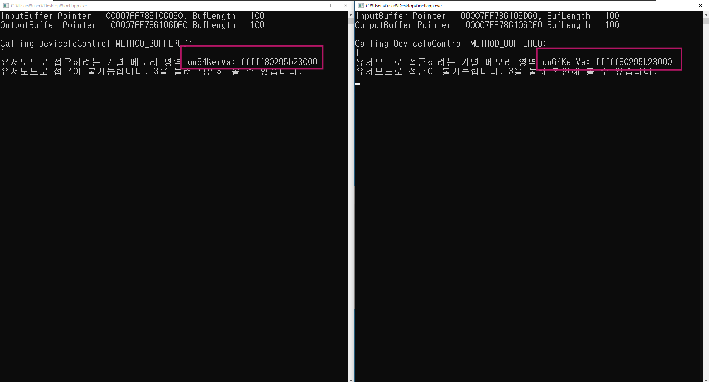
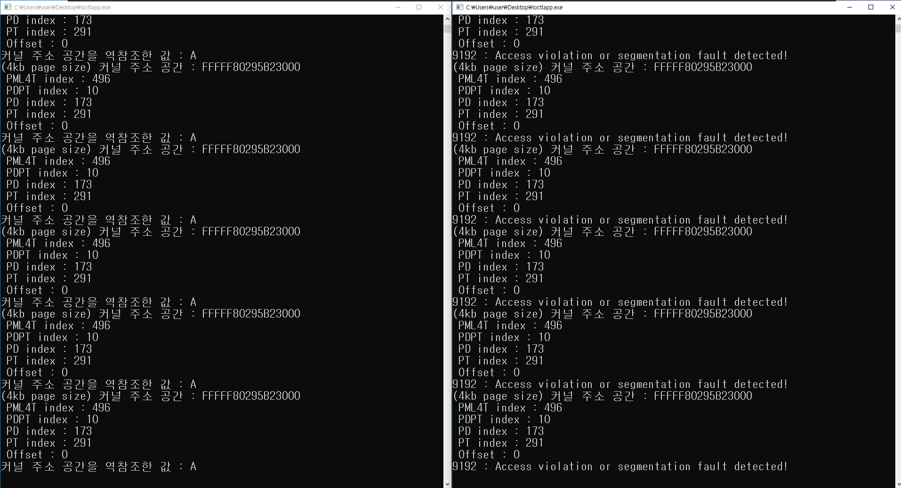
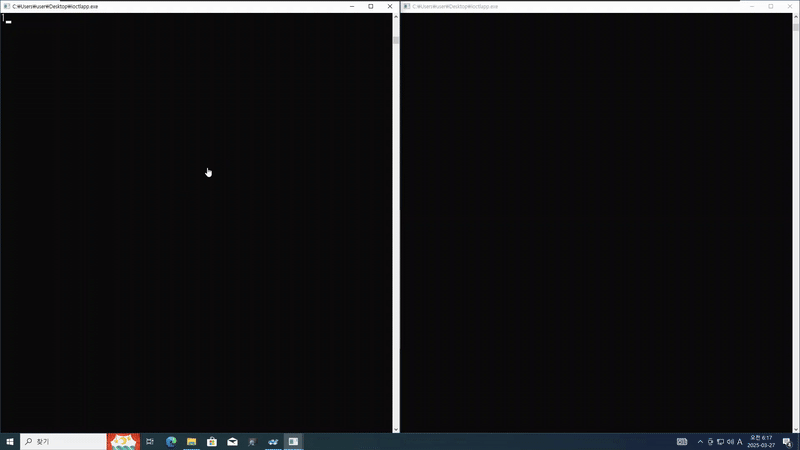
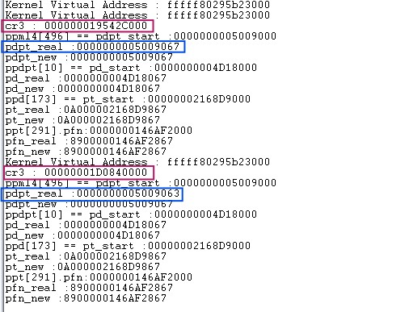

# Access_Kernel_Space_In_UserMode_Kernel_Driver

BoB 13기 Access_Kernel_Space_In_UserMode_Kernel_Driver 프로젝트

## 프로젝트 결과

## 서로 다른 프로세스의 가상 주소 공간은 독립되어있지만, 커널 주소 공간 만큼은 공유한다는 것도 증명 가능하다.

서로 다른 프로세스가 sys 파일의 커널 주소 공간에 접근 하려는데 그 주소가 같음을 알 수 있다.

하지만 한 개의 프로세스에서 옵션 비트를 변경하여 커널 주소 공간에 접근이 가능하다 하더라도

또 다른 프로세스에서는 해당 커널 주소에 접근이 불가능하다.

위의 영상으로도 확인이 가능ㅎ다.

이유는 위 사진을 보면 알 수 있다.

두 프로세스 모두 같은 커널 주소를 사용하고 있지만 CR3 레지스터 값이 다르다.

즉 0x19542C000+8*496 = 0x19542CF80 과 0x1D0840000+8*496 = 0x1D0840F80을 역 참조한 값인 PML4TE의 값(구조체)에서 PFN인 PDPT의 시작 주소만 같고 나머지 옵션 비트는 다르기 때문에 이러한 현상이 발생한다.

그럼 만약 서로 다른 두개의 CR3 레지스터 값으로 서로 다른 PML4TE의 구조체에 접근하여 옵션 비트를 변경하면 두 프로세스에서 하나의 커널 주소 공간에 접근이 가능한가??????????????

## 가능하다.

아래의 영상을 보자

두 프로세스가 같은 커널 주소 공간을 읽은 모습을 알 수 있다.

아래의 영상은 확실히 같은 주소 공간임을 보여주기 위해서 왼쪽 프로세스는 커널 주소 공간의 값을 증가시키고 오른쪽 프로세스는 커널 주소 공간의 값을 출력을 시킨 것이다.

왼쪽 프로세스가 값을 변경 시킴에 따라 오른쪽 프로세스는 출력만 하는데도 값이 변경되는 것을 알 수 있다.

## 자세한 내용
https://cheoljun99.notion.site/access-kernel-space-in-usermode
